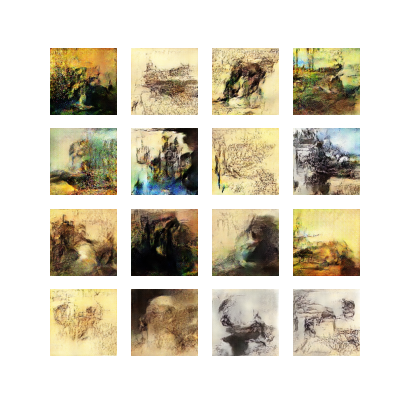
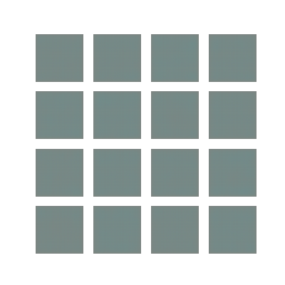
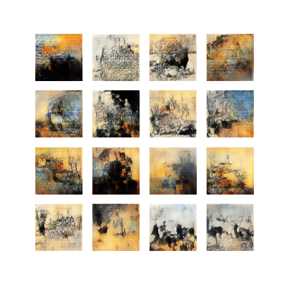
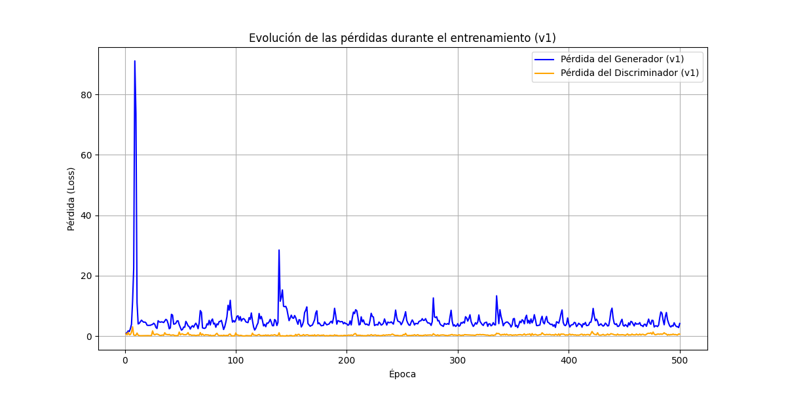
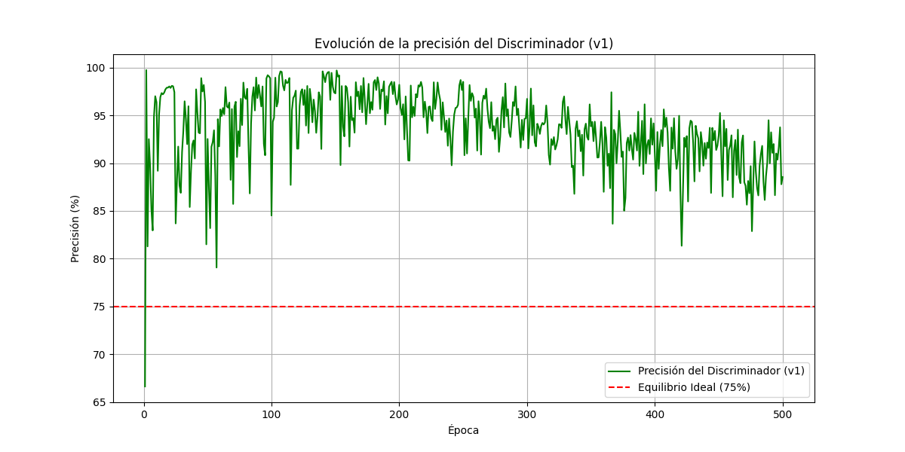
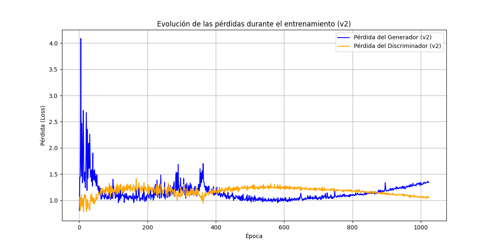
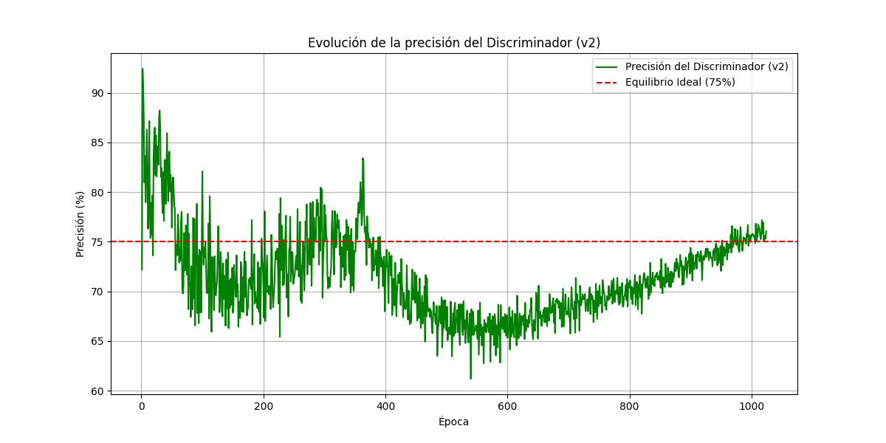

# 🎨 Van-Gogh-GAN: Generador de Arte con Redes Antagónicas



Este proyecto es una implementación de una Red Generativa Antagónica (GAN), específicamente una DCGAN (Deep Convolutional GAN), entrenada para generar imágenes al estilo del pintor Vincent van Gogh. El objetivo principal no era solo construir el modelo, sino también entender, diagnosticar y mejorar el proceso de entrenamiento a través de la experimentación iterativa.

## 🚀 Resultados

Tras un proceso de optimización y entrenamiento, el modelo es capaz de generar imágenes abstractas que capturan la esencia del estilo de Van Gogh, como sus características pinceladas y su paleta de colores.

**Mejora a lo largo del tiempo (v2):**


| Época 1 | Época 500 | Época 1024 |
| :---: | :---: | :---: |
|  |  |  |

---

## 🔬 Análisis del Entrenamiento

Una parte fundamental del proyecto fue analizar y mejorar el rendimiento del modelo. Se realizaron dos experimentos principales.

### Experimento v1: Modelo Base

El primer modelo sufría de un problema común en el entrenamiento de GANs: el **colapso del gradiente debido a un discriminador demasiado fuerte (Discriminator Overpowering)**.

| Pérdidas (v1) | Precisión (v1) |
| :---: | :---: |
|  |  |

**Observaciones:**
* El Discriminador aprendió a diferenciar imágenes reales de falsas mucho más rápido que el Generador a crearlas. Esto se debe a que su tarea, similar a la clasificación, es intrínsecamente más sencilla que la tarea creativa del Generador.
* Esto causó que el Discriminador se volviera un "experto arrogante": su precisión se disparó rápidamente al 90-100%, y su pérdida se mantuvo cercana a cero.
* El problema principal surgió del feedback (gradientes) que recibía el Generador. Cuando el Discriminador estaba tan seguro de que una imagen era falsa (predicción cercana a 0.0), la señal de aprendizaje para el Generador era prácticamente nula. Era como si el crítico le dijera al artista "todo está mal", sin ofrecerle ninguna pista sobre cómo mejorar.
* Como resultado, la pérdida del Generador se mantuvo muy alta y volátil, demostrando un estancamiento en su aprendizaje.

### Experimento v2: Entrenamiento Mejorado

Para solucionar los problemas de la v1 y equilibrar la competición, se implementaron dos estrategias clave:

1.  **Ajuste de Tasas de Aprendizaje:** Se aumentó la tasa de aprendizaje del Generador (2.5e-4) y se redujo la del Discriminador (1e-4) para darle una ventaja y compensar la mayor dificultad de su tarea.
2.  **Suavizado de Etiquetas (Label Smoothing):** Se cambió el objetivo para las imágenes reales de `1.0` a `0.9` en la función de pérdida del Discriminador.

| Pérdidas (v2) | Precisión (v2) |
| :---: | :---: |
|  |  |

**Observaciones:**
* **Éxito de las Estrategias:** Las mejoras tuvieron un impacto drástico y positivo. El suavizado de etiquetas regularizó al Discriminador, impidiéndole volverse "arrogante". Al no poder aspirar a una certeza del 100% (objetivo 1.0), su función de decisión interna se suavizó, pasando de ser un "acantilado" a una "colina".
* **Mejora del Feedback (Gradientes):** El efecto secundario de esta "colina" es que, incluso para las imágenes falsas (cuyo objetivo seguía siendo 0.0), las predicciones del Discriminador se volvieron menos extremas (ej. `0.15` en lugar de `0.0001`). Esto generó un gradiente mucho más rico: en lugar de un "todo está mal", el Generador recibió una señal matizada que le indicaba qué aspectos (como la paleta de colores) iban por buen camino y cuáles (como las formas) necesitaban mejorar.
* **Resultados en las Gráficas:**
    * La **pérdida del Generador (v2)** es ahora mucho más baja y estable, incluso cruzándose y siendo mejor que la del Discriminador en algunas épocas. Esto demuestra que está recibiendo un feedback útil y es un competidor real.
    * La **precisión del Discriminador (v2)** se ha estabilizado en una "tensión competitiva saludable" en torno al 70-80%. Esto es ideal: el Discriminador sigue siendo un crítico competente (acierta la mayoría de las veces), pero el Generador es ahora lo suficientemente bueno como para engañarle 2 o 3 veces de cada 10, demostrando que la batalla está reñida y ambos modelos se fuerzan a mejorar continuamente.

---

## 🛠️ Cómo Usar

### Prerrequisitos
* Python 3.8+
* TensorFlow
* Pandas
* Matplotlib
* (Las versiones exactas están en `requirements.txt`)

### Instalación
1.  Clona el repositorio:
    ```bash
    git clone [https://github.com/ia946/Van-Gogh-GAN.git]
    ```
2.  Navega a la carpeta del proyecto:
    ```bash
    cd Van-Gogh-GAN
    ```
3.  Instala las dependencias:
    ```bash
    pip install -r requirements.txt
    ```

### Ejecución
Abre y ejecuta el notebook `main.ipynb` en un entorno con Jupyter Notebook o Jupyter Lab.

---

## 💻 Tecnologías Utilizadas
* **Python**
* **TensorFlow / Keras** para la construcción y entrenamiento del modelo.
* **Pandas** para el manejo de los logs de entrenamiento.
* **Matplotlib** para la visualización de datos e imágenes.
* **NumPy** para operaciones numéricas.

## 🔮 Futuras Mejoras
El siguiente paso natural para este proyecto es evolucionar de un generador a partir de ruido a un modelo de **traducción de imagen a imagen**. La idea sería implementar una **CycleGAN** para "traducir" una fotografía real (ej. un retrato) al estilo artístico de Van Gogh.

## 👤 Autor
* **Ivelin Apostolov**
* **LinkedIn:** `[]`
* **GitHub:** `[https://github.com/ualia946]`

---
